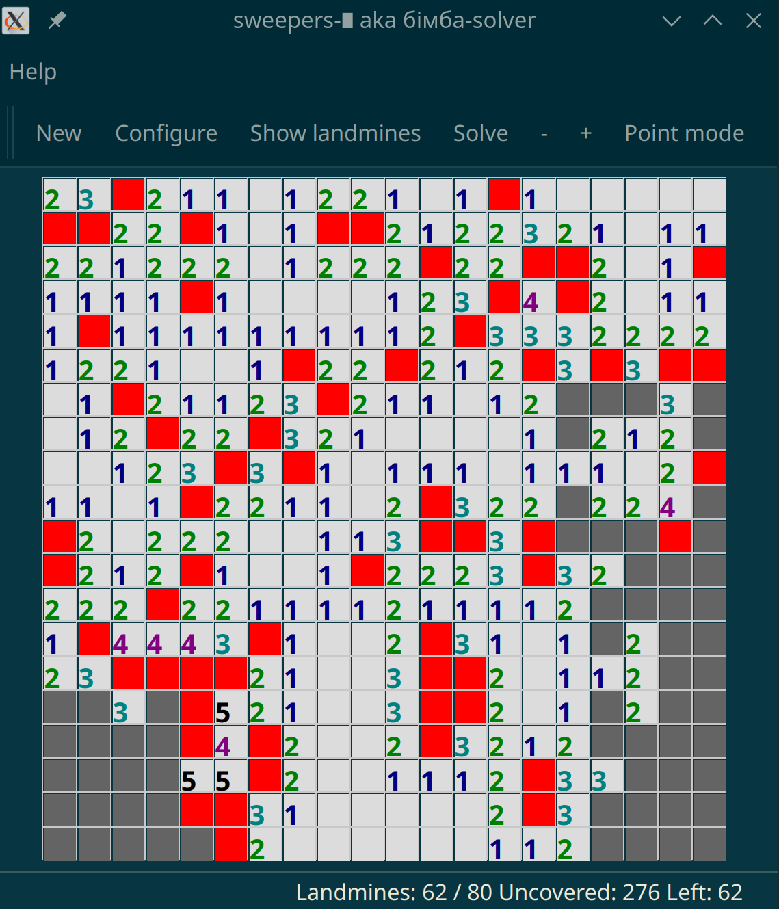

# Sweeper's QED ∎

This is a simple Qt6-based landmines sweeper game with a collection of solvers.
TODO:insert screenshot

## Build/run

```sh
# Make sure qt6 and glpk are available, on ubuntu it'll be something like this:
sudo apt install build-essential libglpk-dev qt6-base-dev cmake

# build with:
cmake -S . -B build
cd build
make -C build -j $(nproc)
build/sweepers-qed
```




## Personal backstory

Back in the late 90's I was a big fan of kmines and spent weeks playing it, what a game. It was as emotionally draining and addictive as fixing desktop puzzles. Eventually I was able to overcome the obsession and moved on with my life.

Fast forward to 2015, I ordered myself a new desktop with the main goal of playing GTA V (which just came out for PC-s). The discrete graphcs card took some time to procure, so the desktop arrived one week sooner without one; I used an older graphics card to boot it up, install Linux, etc, and realized that the only game I could realistically play was - again - kmines! This time I lost 3 days to it, and realized that a way to break the newfound addictive spell was to write a solver for it.

Which I did, using GLPK and a very simple heuristic which is (probably now) explained elsewhere in this doc. It took another 3 days to implement, rendering the original game uninteresting to play.

This week-long detour was so intense I ended up never playing GTA V.

## Surprising profit

3 years later, I was interviewing for a certain company which has a quirk in its interview process - first thing you had to do during a day-long onsite was to present a project of yours to potential teammates, in 30-45 minutes time, and this game fit just fine. I ended up getting an offer.

## How the LP solver Original idea (still is for simplex solvers)

## Global picture

1. Let's call a cell "frontier cell" if it is covered (i.e. still in its original state), and not marked by us as having a landmine, but at the same time it has at least one neighbor cell which is uncovered, i.e. we know it does not have a landmine, and we know its neighboring landmines count.
2. A "frontier" is a set of all frontier cells. This changes as we uncover cells during the game's run.
3. A game run alternates between "solver running" and "solver suspended" states. The former executes a loop described below, and the latter allows player to use the game normally. This is the state where player can uncover enough information for the solver to become useful.
4. Solver running means it simply runs its "step" in a loop described below.

## LP-based solver loop

Copy current frontier into a queue.

1. Pick top queue cell C, look at its 15x15 surrounding cell grid (borders permitting). Pick covered and uncovered cells from the grid.
2. For each covered grid cell, create a floating point variable x[r,c], in the [0, 1] range. 0 means there is no landmine, 1 means there is one.
3. For each uncovered grid cell C, add a linear equation: sum({C's neigbhoring covered cells}) = <C's number of landmines around it> - <number of C's neighboring cells makred as landmines>. None of this requires anything beyond what a player knows from looking at the board.
4. Now, try to maximize(x[ri,ci]) for each variable, using an LP solver. If it's <= 1-epsilon, then the cell at (ri,ci) can not have a landmine -> we uncover it.
5. If we minimize(x[ri,ci]) and get a value >= epsilon, then it must have a landmine, so we mark this as such.
6. For all newly uncovered cells, append their covered neighbors into the queue.

Empirically, this was enough to propagate the game as much as logically possible. I do not have a sound proof for the correctness. The 15x15 grid seemed to be "good enough".

# License

GPLv3
